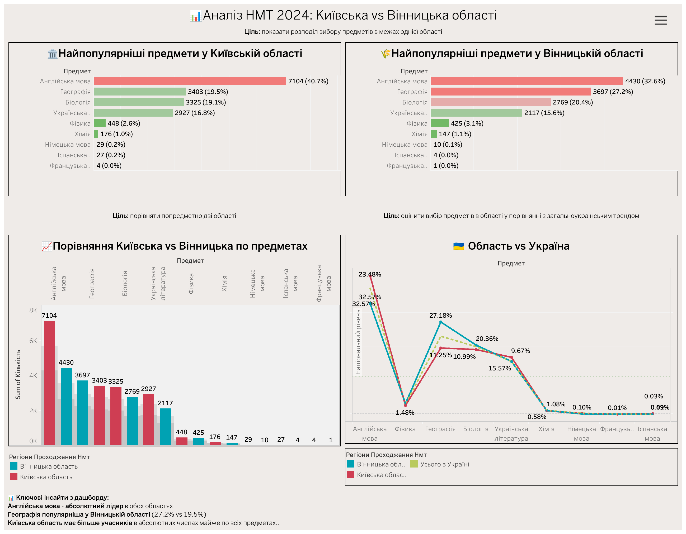
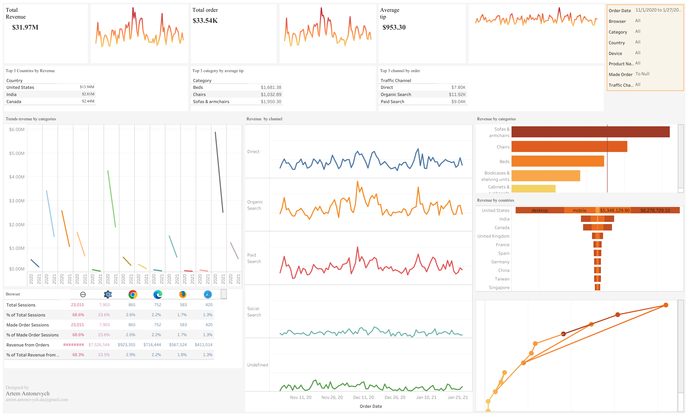
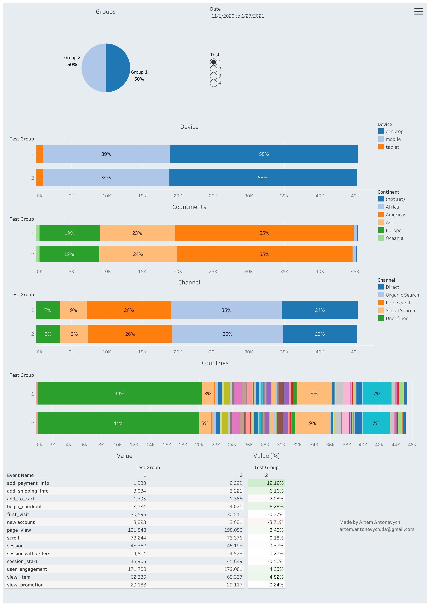
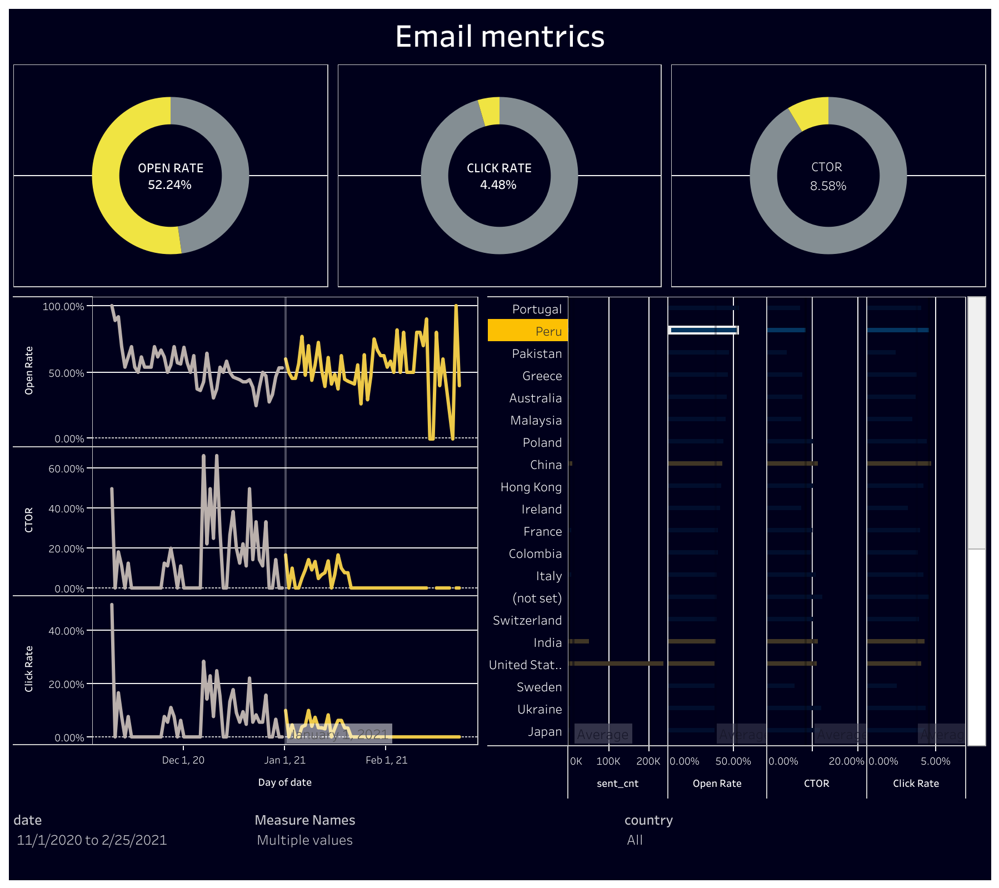
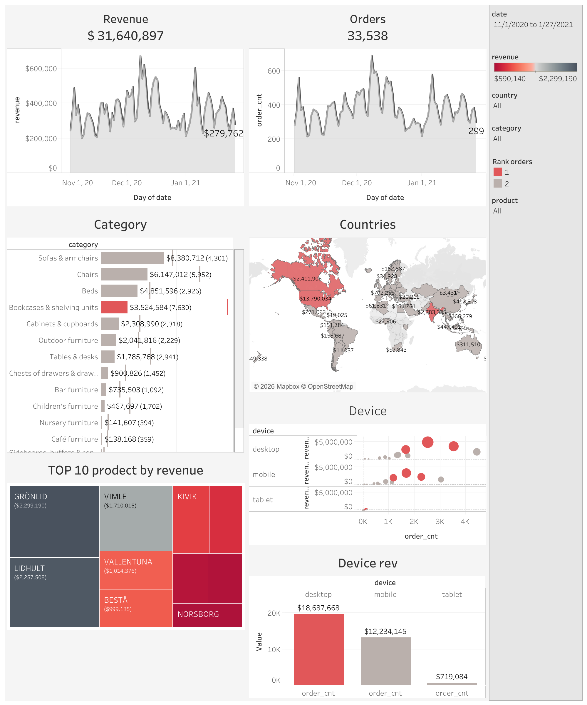

# Tableau Dashboards

Interactive dashboards across education analytics, e-commerce, email marketing and A/B testing.
Live on [Tableau Public — artem.da](https://public.tableau.com/app/profile/artem.da/vizzes).

Each dashboard states the business question, the answer in numbers, and concrete next steps for the teams that own them.

---

## 1. NMT 2024 — Kyiv vs Vinnytsia regions
*Test assignment for the savED charity foundation.*

**Business question.** Which optional subjects do students choose for Ukraine's National Multi-subject Test, and how does subject choice differ between the Kyiv and Vinnytsia regions and the national average?

**Findings.**
- English is the leading subject in both regions — Kyiv 7,104 (40.7%), Vinnytsia 4,430 (32.6%).
- Geography is far more popular in Vinnytsia: 27.2% vs 19.5% in Kyiv — the clearest regional gap.
- Kyiv has more participants in absolute numbers across almost every subject (larger student base).
- The tail is negligible everywhere: Chemistry ~1%, German / Spanish / French < 0.3%.

**Next steps.**
- *Programs team:* prioritise English support nationally; add dedicated Geography programs in Vinnytsia.
- *Regional coordination:* size resources by absolute demand (Kyiv) but tailor the subject mix per region.

Live: [NMT 2024 dashboard](https://public.tableau.com/app/profile/artem.da/viz/_17533580349080/2024vs) · File: [`nmt_2024_kyiv_vs_vinnytsia.twbx`](./nmt_2024_kyiv_vs_vinnytsia.twbx)

---

## 2. Sales & User Behavior Analysis

**Business question.** Where does the $31.97M revenue come from across markets, categories, channels and browsers?

**Findings.** Total Revenue $31.97M · Orders 33.54K · Avg. order value $953.30.
- Revenue is concentrated in a few markets: US $13.94M, then India $2.81M and Canada $2.44M.
- Organic Search is the top channel by order revenue ($11.92K), ahead of Paid Search ($9.04K) and Direct ($7.80K).
- Chrome drives 68.6% of sessions and 68.3% of revenue.

**Next steps.**
- *Marketing:* defend Organic Search (largest revenue channel); concentrate paid spend on the US, India and Canada.
- *Product & UI/UX:* test and optimise primarily on Chrome, where most users and revenue are.

Live: [Sales & User Behavior dashboard](https://public.tableau.com/app/profile/artem.da/viz/PortfolioProject1_17485537077930/Dashboard1) · File: [`sales_user_behavior_analysis.twbx`](./sales_user_behavior_analysis.twbx)

---

## 3. A/B Test Session Analysis

**Business question.** Are the test groups balanced, and which variant performs better down the funnel?

**Findings.**
- Groups are well balanced — 50/50 split, ~45K sessions each, near-identical device, continent and channel mix.
- Variant 2 wins the upper funnel: add_payment_info +12.12%, begin_checkout +6.26%, add_shipping_info +6.16%, view_item +4.82%, user_engagement +4.25%.
- The lift does not reach the bottom funnel: session with orders +0.27%, new account −3.71%.

**Next steps.**
- *Product & UI/UX:* find the drop-off between strong checkout intent and actual orders before rolling out variant 2.
- *Analytics:* extend the test window to confirm the order-level result is not just noise.

File: [`ab_test_session_analysis.twbx`](./ab_test_session_analysis.twbx) · Data model: [A/B Test KPI SQL](../../sql/03-ab-test-kpi-summary/)

---

## 4. Email Metrics

**Business question.** How healthy are our email KPIs (Nov 2020 – Feb 2021), over time and by country?

**Findings.** Open Rate 52.24% · Click Rate 4.48% · CTOR 8.58%.
- A strong open rate with a weak click-through: subject lines work, the content and CTA do not.
- Volume is dominated by a few markets (US, India by sent count), so country-level rates matter more than the global average.

**Next steps.**
- *Marketing:* keep current subject-line approach; rework email body content and CTAs to lift the 4.48% click rate.
- *Marketing:* review the weakest high-volume countries separately rather than chasing the global average.

File: [`email_metrics.twbx`](./email_metrics.twbx)

---

## 5. Sales Quality

**Business question.** Which products, categories, countries and devices drive revenue?

**Findings.** Revenue $31.64M · Orders 33,538.
- Top category: Sofas & armchairs $8.38M (4,301 orders), then Chairs $6.15M and Beds $4.85M.
- Geographically concentrated: US $13.79M, India $2.78M, Canada $2.41M.
- Desktop dominates spend — $18.69M vs $12.23M mobile and $0.72M tablet.
- Top products by revenue: GRÖNLID $2.30M and LIDHULT $2.26M.

**Next steps.**
- *Product:* protect inventory and merchandising for the top-3 categories and lead products.
- *Product & UI/UX:* keep desktop the priority surface; review why tablet revenue is negligible.

File: [`sales_quality.twbx`](./sales_quality.twbx)

---

## How to use
- View live on [Tableau Public](https://public.tableau.com/app/profile/artem.da/vizzes), or
- Download the `.twbx` and open it in Tableau Desktop.

Built on public / sample / anonymised datasets.
